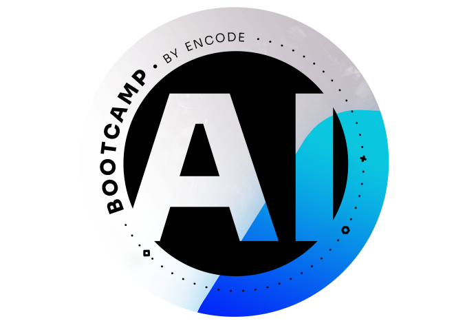
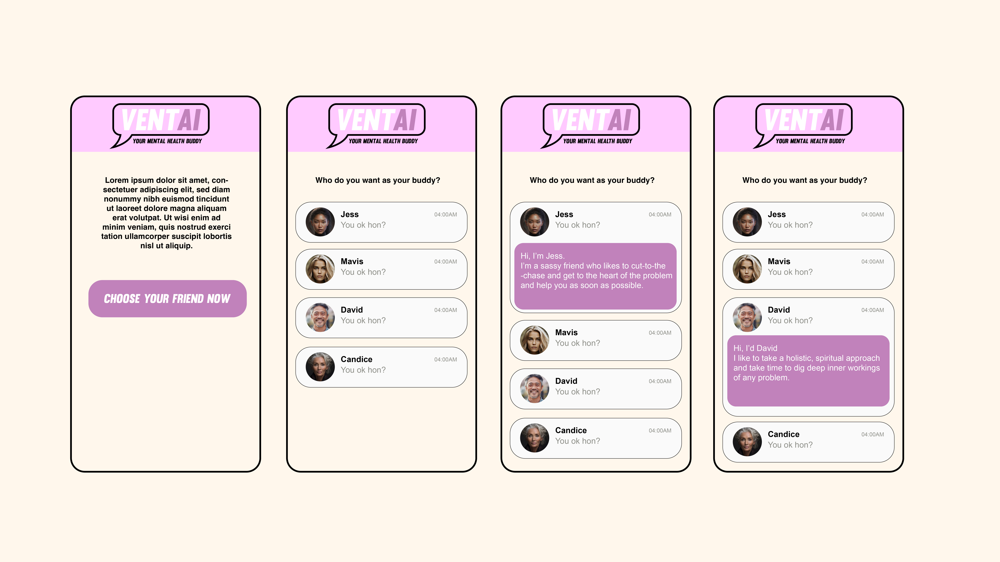
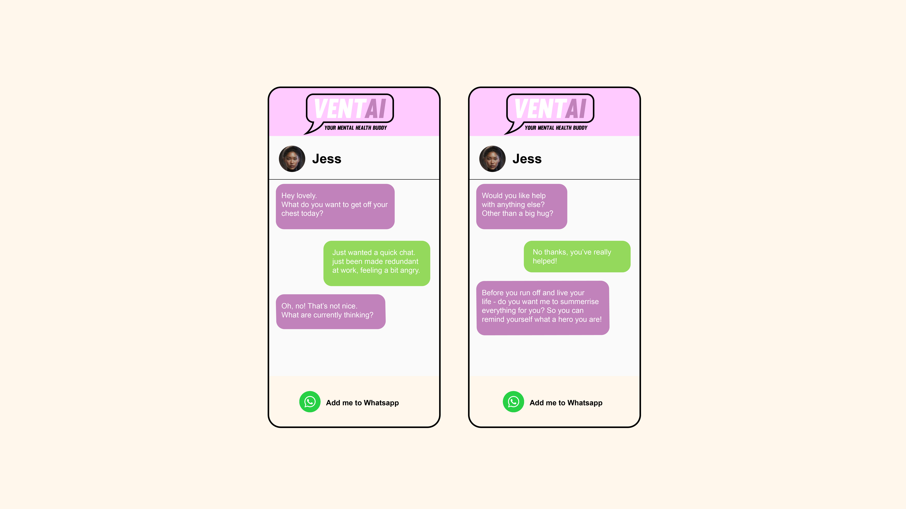

# vent_ai

## **final ai project summary**




Lorem ipsum dolor sit amet, consectetur adipiscing elit, sed do eiusmod tempor incididunt ut labore et dolore magna aliqua. Ut enim ad minim veniam, quis nostrud exercitation ullamco laboris nisi ut aliquip ex ea commodo consequat. Duis aute irure dolor in reprehenderit in voluptate velit esse cillum dolore eu fugiat nulla pariatur. Excepteur sint occaecat cupidatat non proident, sunt in culpa qui officia deserunt mollit anim id est laborum.

## **vent_ai `counsellors`**

&nbsp;&nbsp;&nbsp;
&nbsp;&nbsp;&nbsp;
&nbsp;&nbsp;&nbsp;


Lorem ipsum dolor sit amet, consectetur adipiscing elit, sed do eiusmod tempor incididunt ut labore et dolore magna aliqua. Ut enim ad minim veniam, quis nostrud exercitation ullamco laboris nisi ut aliquip ex ea commodo consequat.

## **vent_ai `wireframes`**

Sketching the user interface for vent_ai
[link](https://www.figma.com/file/brnOBDYtJHnNsbNI42ggOc/ipadvent?type=design&node-id=101%3A2&mode=design&t=SVSE8qx9mKP6g9UD-1)

&nbsp;&nbsp;&nbsp;

 

<br>

### **vent_ai `setup`:**

```
export OPENAI_API_KEY=""
echo $OPENAI_API_KEY
```

### **`building` vent_ai - the app:**

```
nvm use 18.17.0
cd app
npm run dev
```

### **`tech` stack**

&nbsp;&nbsp;&nbsp;


 <br>


### **next `steps`**

 &nbsp;&nbsp;&nbsp;

- access to vent_ai within WhatsApp
- refactor
- allow users to create their own counsellor
- dial when responses being generated
- voice note capability along with messaging options
- video messaging option between vent_ai counsellor and user
